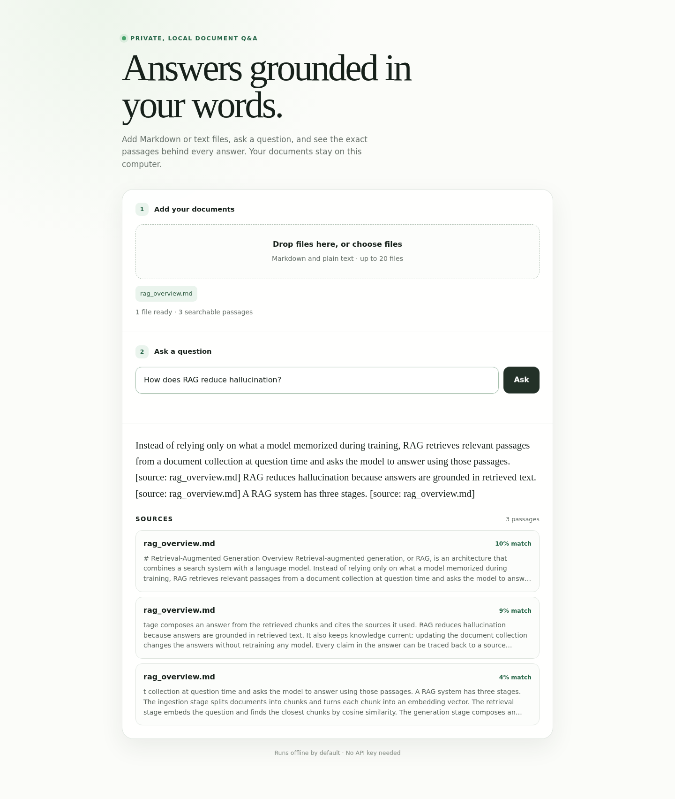
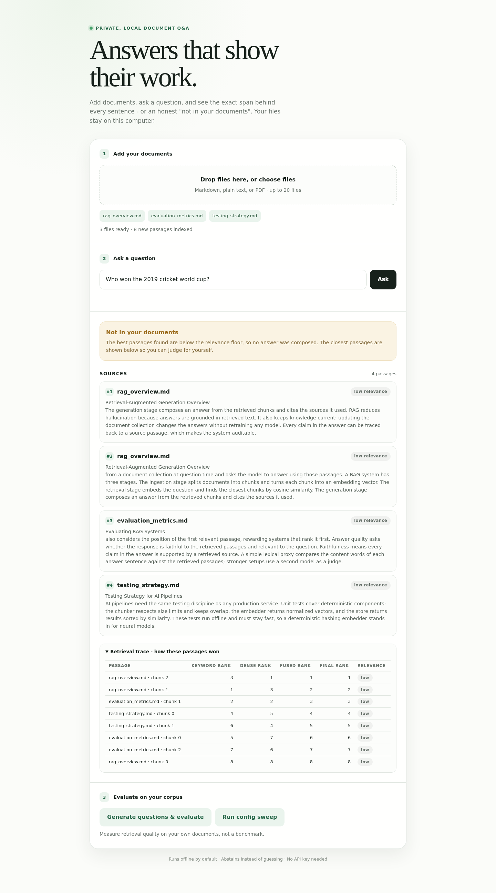

# rag-qa-engine

An evaluation-first retrieval-augmented generation (RAG) app in Python. Add Markdown, text, or PDF documents in a minimal browser interface, ask questions, and get answers where **every sentence links to the exact source span it rests on** - or an honest "not in your documents".

Local RAG with citations is the most-built project on GitHub. This one's center of gravity is different: a user-facing evaluation harness, abstention instead of guessing, and a retrieval stack that shows its work at every stage.

The project runs **fully offline by default**. Its deterministic hashing embedder, BM25 index, lexical reranker, and extractive answer generator need no downloads, API keys, or network connection after installation.

  
[](https://github.com/dcr6174/rag-qa-engine/actions/workflows/ci.yml)



## What it does

1. Reads your `.md`, `.txt`, and `.pdf` documents.
2. Splits them **structure-aware**: heading breadcrumbs, atomic tables and code blocks, small chunks for precision, parent sections for context, stable offsets into the original file.
3. Retrieves with **BM25 + dense vectors fused by Reciprocal Rank Fusion**, then reranks the top candidates.
4. Answers only when the best passage clears a relevance floor - otherwise it **abstains** and shows you what it found.
5. Links **every answer sentence** to a span in the original document and runs an **entailment check** before display. Unsupported sentences are flagged, not hidden.
6. **Evaluates itself on your corpus**: generated QA pairs, recall@k, nDCG@k, MRR, faithfulness, false-answer rate, and a config-sweep leaderboard.



## Why these choices

**Hybrid retrieval, not dense-only.** Dense-only retrieval fails exactly where document QA gets used: error codes, version numbers, SKUs, acronyms, rare proper nouns. BM25 covers that; RRF fuses the two ranked lists in about sixty lines with no tuning.

**Reranking beats embedding upgrades.** Re-scoring the fused top 50 with a cross-encoder lifts retrieval quality more than any embedding-model upgrade you can run locally. The default offline reranker is lexical and deterministic; `bge-reranker-base` or `ms-marco-MiniLM-L-6-v2` drop in via the optional `sentence-transformers` extra and run on CPU.

**Bands, not percentages.** Cosine similarity is not calibrated and is not comparable between queries - showing `0.82` invites users to read it as confidence in the answer, which it is not. The UI shows rank plus a coarse relevance band from the reranker instead.

**Abstention is a feature.** The most valuable thing a QA tool can say is "this isn't in your documents." The answer gate is the top reranked score; below the floor, the app refuses and shows what it retrieved. The eval harness measures honesty directly: a no-answer subset of the QA set reports the **false-answer rate** - a system with 90% hit rate and 40% false-answer rate is worse than useless.

**Structure-aware chunking.** Splitting Markdown by character count destroys the structure that makes Markdown worth having. Here, chunks split on the heading hierarchy, every chunk is prefixed with its heading breadcrumb before embedding, tables and fenced code blocks are never split, and small chunks retrieve while their enclosing section supplies generation context. Character offsets into the original file survive every step, so citation highlights can never drift - a property test proves it.

**Numpy brute force, on purpose.** Under roughly 100k chunks, a brute-force dot product over an in-memory matrix is the right answer: exact, instant at this scale, zero extra dependencies. FAISS would add surface area before the basics are tuned. If a corpus outgrows it, `sqlite-vec` plus FTS5 gives vectors, keyword search, and persistence in one file with no server.

**Store hygiene.** Persisted stores record the embedding model name, dimension, tokenizer, and chunker config, and **refuse to load** under mismatched settings - silent model mismatch produces plausible garbage and is miserable to diagnose. Chunks are content-hashed, so re-indexing embeds only what changed.

**Retrieved text is untrusted.** A document containing "ignore previous instructions" is a live attack in a QA tool. Retrieved context is framed as delimited, untrusted data in the prompt and never reaches any tool call.

## Prerequisites

- Python 3.10 or newer
- A modern browser such as Chrome, Edge, Firefox, or Safari
- About 100 MB of free disk space for the default install
- No API key, GPU, database, or external model download

## Copy-paste Windows setup

### 1. Install Python

Install Python 3.10 or newer from [python.org](https://www.python.org/downloads/). On the installer screen, tick **Add python.exe to PATH**.

### 2. Download this project

Click **Code** near the top of this GitHub page, choose **Download ZIP**, and unzip it. Open the unzipped `rag-qa-engine` folder, click the address bar in File Explorer, type `powershell`, and press Enter.

### 3. Install it (one time)

```powershell
py -3.10 -m venv .venv
.venv\Scripts\Activate.ps1
python -m pip install -r requirements.txt
```

### 4. Start the app

```powershell
uvicorn rag_qa.api:app --app-dir src
```

Leave PowerShell open. Visit **http://127.0.0.1:8000** in Chrome or Edge.

### 5. Try the first example

1. Upload `sample_data/rag_overview.md` from the project folder.
2. Wait for **1 file ready**.
3. Ask: **How does RAG reduce hallucination?**
4. Click **Ask**.

### Expected output

You should see an answer whose sentences carry small numbered references. Under **Sources**, each passage card shows its final rank, a coarse relevance band (high / medium / low), and the exact highlighted span behind the answer sentences. Open **Retrieval trace** to see every candidate's keyword, dense, fused, and final rank. Then ask something the document cannot answer, like **Who won the 2019 cricket world cup?** - the app abstains and shows the closest passages instead of inventing an answer.

To use your own material, drop one or more `.md`, `.txt`, or `.pdf` files into the upload area, wait until they are ready, and ask a question. PDF citations carry page numbers, so you can check them in the original document.

The browser sends document text only to the app running on your own computer. The default setup does not upload it to an external service. Stop the app with `Ctrl+C` in PowerShell.

## Mac or Linux setup

```bash
python3 -m venv .venv
source .venv/bin/activate
python -m pip install -r requirements.txt
uvicorn rag_qa.api:app --app-dir src
```

Then open http://127.0.0.1:8000.

## API

The interactive API docs live at http://127.0.0.1:8000/docs.

```bash
# Index the bundled sample_data folder
curl -X POST localhost:8000/ingest -H 'content-type: application/json' -d '{}'

# Ask a question (abstains when the documents do not support an answer)
curl -X POST localhost:8000/ask -H 'content-type: application/json' \
  -d '{"question":"How does RAG reduce hallucination?"}'
```

Endpoints:

- `GET /` - browser interface
- `GET /health` - service and index status
- `POST /ingest` - index `.md`, `.txt`, and `.pdf` files from server-side paths
- `POST /ingest-text` - index browser-supplied text documents without saving uploads
- `POST /ingest-pdf` - index PDF uploads with page-anchored citations
- `POST /ask` - answer with sentence-level citations, relevance bands, and a retrieval trace
- `POST /ask/stream` - the same answer over server-sent events: sources first, then the answer, then citations
- `POST /evaluate` - run a labelled QA set, or generate one from the indexed corpus
- `POST /sweep` - config sweep (chunk size, overlap, k) with a ranked leaderboard
- `POST /store/save`, `POST /store/load` - persist and reload the index; loading refuses mismatched build settings

`/ingest`, `/store/save`, and `/store/load` take a filesystem path from the caller. By default they only accept paths inside the project directory - set `RAG_ALLOWED_ROOTS` (an `os.pathsep`-separated list of directories) to permit additional paths elsewhere. This app is meant to run on `127.0.0.1` for a single local user; do not expose it on a shared network without adding authentication in front of it.

## Evaluation

```bash
# labelled fixture set (includes a no-answer subset for the false-answer rate)
python scripts/run_eval.py

# sweep chunk size / overlap / k and rank the leaderboard
python scripts/run_sweep.py

# generate a QA set from your own documents, then evaluate on it
python scripts/generate_eval.py path/to/your/docs
```

Example output on the bundled corpus:

```text
questions=11 hit@4=1.00 mrr=1.00 ndcg@4=1.00 recall@1=1.00 recall@3=1.00
recall@5=1.00 faithfulness=1.00 abstention-rate=0.27 false-answer-rate=0.00
```

The browser app exposes the same harness: **Generate questions & evaluate** builds a QA set from your uploaded corpus and reports hit@k, MRR, nDCG@k, faithfulness, and abstention rate; **Run config sweep** ranks chunking configurations so you can say "these docs retrieve best at 600 characters with 15% overlap" and mean it.

## Architecture

```text
.md / .txt / .pdf
      |
      v
 structure-aware chunker          headings, breadcrumbs, atomic tables/code,
      |                            stable offsets, parent sections, content hashes
      v
 +----------------------+    +------------------+
 | dense vectors (numpy |    | BM25 keyword     |
 | brute-force search)  |    | index            |
 +----------+-----------+    +---------+--------+
            |                       |
            +-------- RRF fuse -----+
                      |
                      v
                 reranker           lexical offline default,
                      |             optional cross-encoder on CPU
                      v
              abstention gate       below the floor: refuse, show passages
                      |
                      v
            answer generator        offline extractive default,
                      |             optional OpenAI-compatible endpoint
                      v
      sentence-level citations      span offsets + entailment check
                      |             per sentence, before display
                      v
                  answer
```

```text
src/rag_qa/
  api.py             API endpoints and browser app entry point
  static/index.html  answer screen: sentence citations, bands, trace, eval panel
  chunking.py        structure-aware Markdown chunking with stable offsets
  bm25.py            Okapi BM25 keyword index
  retrieval.py       hybrid fusion (RRF) and the per-stage trace
  rerank.py          lexical reranker + optional cross-encoder, relevance bands
  citations.py       sentence-level citations, entailment, abstention gate
  generate.py        generators, prompt-injection isolation, follow-up rewriting
  embeddings.py      offline hashing + optional neural embeddings
  store.py           vector store: persistence, metadata hygiene, content hashes
  pdf.py             PDF text extraction with page anchors
  pipeline.py        the end-to-end pipeline
  evaluate.py        metrics, corpus QA generation, config sweeps
scripts/             run_eval.py, run_sweep.py, generate_eval.py
sample_data/         bundled demo documents
eval/qa_pairs.jsonl  labelled questions plus a no-answer subset
tests/               67 automated tests
```

## Testing

**Windows (PowerShell)**

```powershell
$env:PYTHONPATH="src"
pytest tests/ -q
python scripts/run_eval.py
```

**Mac or Linux**

```bash
PYTHONPATH=src pytest tests/ -q
python scripts/run_eval.py
```

The 67 tests are built for a retrieval system, not a demo:

- **eval-as-regression** - the fixture corpus must stay above hit@k / MRR / faithfulness floors and below a false-answer ceiling, so a chunker change that quietly hurts retrieval fails CI
- **golden chunk boundaries** - block kinds, breadcrumbs, atomic tables and code blocks on a fixture document
- **citation-offset property test** - every citation offset produced on the fixture corpus resolves to the exact quoted text in the original document
- store hygiene (mismatch refusal, incremental re-indexing), abstention behavior, hybrid retrieval traces, PDF page anchors, the SSE stream, and every API endpoint

## Optional higher-quality models

The app does not need these to work.

```bash
pip install sentence-transformers   # neural embeddings + cross-encoder reranker
pip install openai                  # OpenAI-compatible answer generation
```

Set environment variables in your own terminal, never in committed files:

```bash
export RAG_EMBEDDER=sentence-transformers
export RAG_RERANKER=cross-encoder
export OPENAI_API_KEY=your-key
export RAG_MODEL=gpt-4o-mini
```

## Common errors

- **`py` or `python` is not recognized** - reinstall Python from python.org and tick **Add python.exe to PATH**.
- **PowerShell blocks activation** - run `Set-ExecutionPolicy -Scope Process Bypass`, then `.venv\Scripts\activate` again.
- **`No module named uvicorn`** - activate `.venv`, then run `pip install -r requirements.txt`.
- **Port 8000 is already in use** - start with `uvicorn rag_qa.api:app --app-dir src --port 8001`, then open http://127.0.0.1:8001.
- **The app says to add documents first** - upload at least one non-empty file before asking.
- **A PDF uploads but indexes nothing** - it has no text layer (a scan). This version does not OCR; convert it with an OCR tool first.
- **The store refuses to load** - it was built with a different embedder or chunker configuration. Re-index the documents; do not mix stores across settings.
- **The app abstains on a question you expected it to answer** - the default offline stack is lexical. Terms the documents never use cannot match; the optional neural embedder and cross-encoder close most of that gap.

## License

MIT - see [LICENSE](LICENSE).
